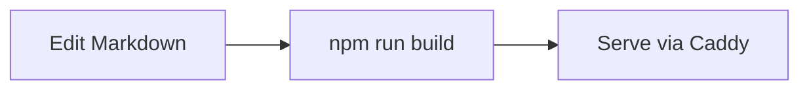

# @kaunofakultetas/docusaurus-preset

A shared [Docusaurus](https://docusaurus.io/) preset that gives every KnF docs site the same look and feel:

- **VU brand theming** with light **and** dark mode (maroon navbar, VU colour
  palette, brand fonts).
- **Mermaid** enabled out of the box for UML / flow / sequence diagrams.
- **Bundled brand assets** (VU + Kauno fakultetas logos, favicon) shipped inside
  the package — no need to copy SVGs into every repo.

---

## Add docs to an existing repo (from zero)

This guide sets up a minimal documentation site **inside an existing code repo**,
living in a `docs/` folder and served at the site root (`/`).

### 1. Create the folder and `package.json`

```bash
mkdir docs && cd docs
```

`docs/package.json`:
```json
{
  "name": "docs",
  "private": true,
  "scripts": {
    "start": "docusaurus start",
    "build": "docusaurus build",
    "serve": "docusaurus serve",
    "typecheck": "tsc"
  },
  "dependencies": {
    "@docusaurus/core": "3.10.1",
    "@kaunofakultetas/docusaurus-preset": "github:kaunofakultetas/docusaurus-preset",
    "@mdx-js/react": "^3.0.0",
    "react": "^19.0.0",
    "react-dom": "^19.0.0"
  },
  "devDependencies": {
    "@docusaurus/module-type-aliases": "3.10.1",
    "@docusaurus/tsconfig": "3.10.1",
    "@docusaurus/types": "3.10.1",
    "@types/react": "^19.0.0",
    "typescript": "~6.0.2"
  },
  "engines": { "node": ">=20.0" }
}
```

`@docusaurus/preset-classic` and `@docusaurus/theme-mermaid` are **provided by
this preset** — you don't list them yourself.

### 2. Install

```bash
npm install
```

Installing from GitHub automatically runs the preset's `prepare` script, which
compiles its TypeScript and copies the brand assets into `node_modules/.../lib`.
You always get a fresh build.

### 3. `tsconfig.json`

`docs/tsconfig.json` (only used for IDE type-checking and `npm run typecheck`):

```json
{
  "extends": "@docusaurus/tsconfig",
  "compilerOptions": {
    "baseUrl": ".",
    "ignoreDeprecations": "6.0",
    "strict": true
  },
  "exclude": [".docusaurus", "build"]
}
```

### 4. `docusaurus.config.ts`

```ts
import path from "path";
import type { Config } from "@docusaurus/types";
import type { PresetOptions } from "@kaunofakultetas/docusaurus-preset";

// Serve the brand assets bundled inside the preset (logos + favicon) as if they
// were local static files — they end up under /img/* in the build output.
const presetStaticDir = path.join(
  path.dirname(require.resolve("@kaunofakultetas/docusaurus-preset")),
  "static",
);

const config: Config = {
  title: "Project",
  url: "https://example.knf.vu.lt",
  baseUrl: "/",
  favicon: "img/vuLogo.svg",
  markdown: { mermaid: true },
  staticDirectories: ["static", presetStaticDir],

  presets: [
    [
      "@kaunofakultetas/docusaurus-preset",
      {
        docs: {
          path: "content",            // Markdown lives in docs/content/
          routeBasePath: "/",         // docs served at the site root
          sidebarPath: require.resolve("./sidebars.ts"),
        },
      } satisfies PresetOptions,
    ],
  ],

  themeConfig: {
    navbar: {
      title: "My Project",            // shown to the right of the logo
      logo: { alt: "Kauno fakultetas", src: "img/knfLogoText.svg" },
      items: [],
    },
  },
};

export default config;
```

Update the config values (title, url, navbar title, etc.) for the project.

### 5. `sidebars.ts`

```ts
import type { SidebarsConfig } from "@docusaurus/plugin-content-docs";

const sidebars: SidebarsConfig = {
  // Auto-generate the sidebar from the folder structure of content/
  docs: [{ type: "autogenerated", dirName: "." }],
};

export default sidebars;
```

### 6. Write your first page

Because the docs are served at the root (`routeBasePath: "/"`), **one** page must
claim the `/` route via `slug: /` front matter — otherwise the homepage 404s.

`docs/content/intro.md`:

````md
---
slug: /
title: Welcome
---

# Welcome

These docs are styled with the VU / Kauno fakultetas preset.


````

Add more pages as plain `.md` / `.mdx` files under `content/`; the sidebar picks
them up automatically.

### 7. Run it

```bash
npm start          # dev server with hot reload (http://localhost:3000)
npm run build      # production build → docs/build/
npm run serve      # serve the production build locally
```

---

## Configuration reference

The preset accepts these options (all optional):

```ts
interface PresetOptions {
  // Shortcut for docs.sidebarPath. Defaults to `false` (no sidebar).
  sidebarPath?: string | false;
  // Passed through to @docusaurus/plugin-content-docs (path, routeBasePath,
  // editUrl, sidebarPath, etc.).
  docs?: Partial<ClassicOptions["docs"]>;
  // Escape hatch: anything here is merged into the underlying preset-classic
  // options (blog, pages, sitemap, theme, …).
  classic?: Partial<ClassicOptions>;
}
```

### Branding knobs

Theming is driven entirely by CSS variables, so a consuming site usually doesn't
touch it. If you need to, override the variables in your own `custom.css` (added
via `classic.theme.customCss`). Key ones: `--ifm-color-primary*`, `--vu-accent`,
`--ifm-navbar-background-color`, `--ifm-background-color`.

The navbar logo is rendered white to read on the maroon bar. To change the logo
or title, edit `themeConfig.navbar` in your site config (it's per-site, not part
of the preset).

---

## Deployment (Docker + Caddy)

The build output (`docs/build/`) is fully static. The pattern below bakes it into
a Caddy image; an upstream Caddy can then reverse-proxy to the container.

`docs/Dockerfile`:

```dockerfile
# ---- build stage ----
FROM node:20-alpine AS build
# git is required to install the preset from GitHub
RUN apk add --no-cache git
WORKDIR /app
COPY package*.json ./
# Use `npm ci` once you commit a package-lock.json for reproducible builds.
RUN npm install
COPY . .
RUN npm run build

# ---- serve stage ----
FROM caddy:2-alpine
COPY --from=build /app/build /srv
COPY Caddyfile /etc/caddy/Caddyfile
```

`docs/Caddyfile`:

```caddyfile
:80 {
	root * /srv
	encode gzip zstd
	file_server
	# Serve Docusaurus's 404 page for unknown routes
	handle_errors {
		rewrite * /404.html
		file_server
	}
}
```

Build and run:

```bash
cd docs
docker build -t my-project-docs .
docker run --rm -p 8080:80 my-project-docs
```

Notes:

- **Sub-path hosting:** if your upstream Caddy mounts the site under `/foo`, set
  `baseUrl: "/foo/"` in `docusaurus.config.ts` and rebuild — asset URLs are
  baked in at build time.
- **Already have a central Caddy?** You can skip the Caddy stage entirely and
  point your existing Caddy's `root` at the static `build/` directory.

---

## Developing the preset itself

```bash
git clone https://github.com/kaunofakultetas/docusaurus-preset
cd docusaurus-preset
npm install            # `prepare` builds lib/ automatically
```

Source lives in `src/` (TypeScript + `src/css/custom.css`); brand assets live in
`static/img/`. `npm run build` compiles to `lib/` (`tsc` + copies CSS and static
assets). `lib/` is git-ignored and rebuilt on every install.

A test site lives in `website/` (consumes the preset via `file:..`):

```bash
cd website
npm install
npm start          # or: npm run build
```

After changing the preset, rebuild it (`npm run build` at the repo root) before
rebuilding the test site so the changes are picked up.
